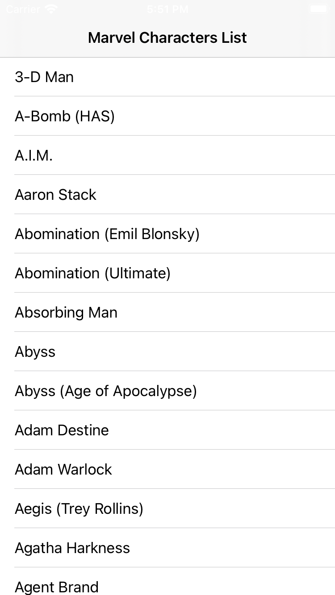
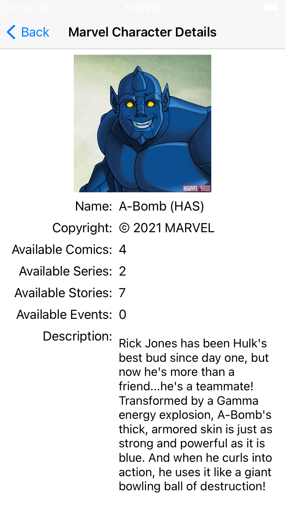

# Marvel Skeleton POC
The purpose of this document is to explain the architecture of application.

Below is running app screenshots:

## Table of Contents
1. [Architecture]
2. [Implementation]
3. [Testing]
4. [Project Setup]

## 1. Architecture
We divided the app code into different folder which act as logical units. Each unit have their own responsibility and behavior.
This app divided into below folder structure:

* [**Data**]
Responsible for obtain all the data required by the application.
It consist below things:
[**Entities**]: It defines to fit API needs
[**Services**]: Service layer is an abstraction layer on top Moya
[**Providers**]: It handel the srvices and  retrieve the srvices response which are represented in Entities.

* [**Domain**]
Handler of all business logic and models.
It consist below things:
[**Models**]: Models are Entities domain model representation.
[**UseCases**]: It consist Protocols and their implementations to represent business logics
[**ProviderProtocols**]: These are Protocol Classes which protocols without its implementation.

* [**Presentation**]
All user actions on view, handled by this module.
It consist below things:
[**userInterface**]:  Contains the stroybook and views to display UIcontrols
[**Builder**]: Builder is responsible to instantiate the classes and passes any dependencies to class. 
[**Presenter**]: It is responsible to update the viewController.
[**ViewController**]: It links the user controls to update them when needed.
[**ViewModel**]: It consist the UI view model data which is useful to render the view.

* [**Core**]
It defines app core feature like the base viewProtocol, and base presenterProtocol.

## 2. Implementation
To develop this POC, we are using MVP-CLEAN architecture.
We devided the code into logical units and each logical units have different-different responsibilities.

## 3. Testing
* Under Data module, we have written unit test cases for Entities, and Providers.
* Under Domain module, we have written unit test cases for Models, and UseCases.
* Under Presentation module, we have written unit test cases for Builders, and Presenters.

## 4. Project Setup
To run this POC on local machine follow below steps:
* Open MarvelSkeleton.xcodeproj file and wait till required swift packages loading done.

